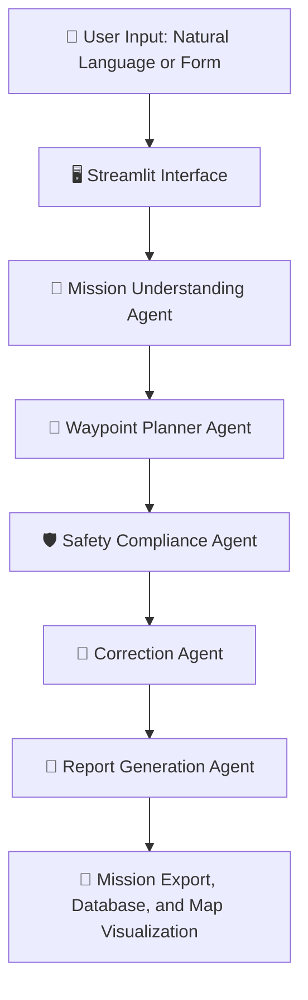
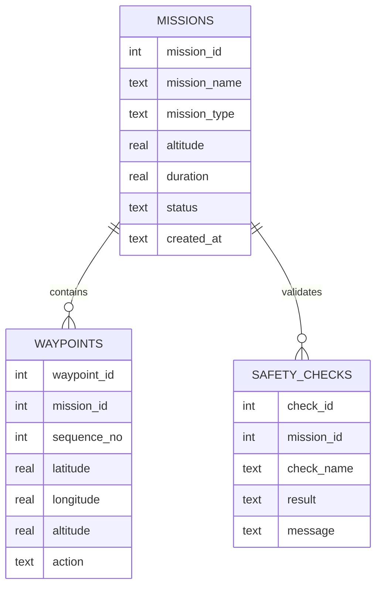

<div align="center">


[](https://www.python.org/)
[](https://streamlit.io/)
[](https://sqlite.org/)
[](https://python-visualization.github.io/folium/)
[](LICENSE)


<br/>

> 🛸 **An end to end software application for planning UAV missions through an agentic AI workflow.**
> Accepts natural language mission requests, generates waypoints, validates airspace safety rules, suggests corrections, and produces exportable flight plans and compliance reports.

> 🔒 **No physical UAV hardware required.** This is a fully software based simulation project.

</div>

<div align="center">

</div>

---

## 📋 Table of Contents

- [🎯 Problem Statement](#-problem-statement)
- [🏗️ System Architecture](#️-system-architecture)
- [🤖 Agentic Workflow](#-agentic-workflow)
- [✨ Key Features](#-key-features)
- [🛡️ Safety Rules](#️-safety-rules)
- [🗺️ Waypoint Patterns](#️-waypoint-generation-patterns)
- [📦 Technology Stack](#-technology-stack)
- [📁 Project Structure](#-project-structure)
- [⚙️ Setup and Run](#️-setup-and-run)
- [🖥️ Application Pages](#️-application-pages)
- [🗄️ Database Schema](#️-database-schema)
- [📅 8 Week Internship Plan](#-8-week-internship-plan)
- [🔮 Future Enhancements](#-future-enhancements)
- [📬 Contact](#-contact)

---

## 🎯 Problem Statement

UAV mission planning requires careful definition of waypoints, altitude limits, mission duration, geofence restrictions, return to launch behaviour, and safety constraints. Manual planning can lead to mistakes such as:

<div align="center">

| Problem | Impact |
|---|---|
| 🔴 Missing landing points | UAV never returns home |
| 🔴 Unsafe altitude values | Airspace regulation violation |
| 🔴 Routes crossing restricted zones | Collision or legal penalty |
| 🔴 Incomplete mission instructions | Mission abort mid flight |

</div>

This project proposes a software assistant that helps users create safer and better structured UAV mission plans through an agentic workflow.

---

## 🏗️ System Architecture

<div align="center">



</div>

---

## 🤖 Agentic Workflow

The system uses **5 specialized agents**, initially implemented as Python modules. An LLM API (Google Gemini) is used for natural language parsing with a regex fallback.

<div align="center">

| Agent | File | Purpose |
|---|---|---|
| 🧠 **Mission Understanding** | `agents/mission_understanding_agent.py` | Parses natural language via Gemini API (regex fallback), extracts mission type, altitude, duration, route pattern, and safety constraints |
| 📍 **Waypoint Planner** | `agents/waypoint_planner_agent.py` | Generates takeoff, route waypoints, altitude values, sequence numbers, and RTL point for 4 flight patterns |
| 🛡️ **Safety Compliance** | `agents/safety_compliance_agent.py` | Enforces 7 airspace rules covering altitude, RTL, geofence, waypoint distance, duration, and battery estimate |
| 🔧 **Correction** | `agents/correction_agent.py` | Suggests corrections for failed safety checks: altitude clipping, waypoint relocation outside no fly zones, duration reduction |
| 📄 **Report Generation** | `agents/report_agent.py` | Generates HTML mission summary with safety checklist, flight metrics, and approval status |

</div>

### 💬 Example Natural Language Input

```
Plan a surveillance mission around FAST campus for 20 minutes.
Keep altitude below 80 meters, avoid restricted zones,
and return to launch after completion.
```

### 📤 Example Extracted Output (Mission Understanding Agent)

```json
{
  "mission_type": "surveillance",
  "altitude": 60,
  "duration": 20,
  "return_to_launch": true,
  "avoid_no_fly_zone": true,
  "route_pattern": "square"
}
```

---

## ✨ Key Features

- 🗣️ **Natural language mission input**: parsed by Google Gemini API with regex fallback
- 📝 **Manual input form**: mission name, type, altitude, duration, route pattern, home coordinates
- 📍 **Waypoint generation**: square, grid, circle, and perimeter route patterns
- 🗺️ **Interactive map view**: home point, waypoint markers, flight path, no fly zone overlays (Folium)
- 🛡️ **7 rule safety checker**: altitude, RTL, takeoff, geofence, leg distance, duration, battery
- 💡 **Correction suggestions**: actionable fixes for every failed safety rule
- 📄 **Mission summary report**: inline HTML report with checklist and approval status
- 💾 **SQLite database**: stores missions, waypoints, and safety check results
- 📥 **Export**: Mission JSON, Waypoints CSV, PDF report

---

## 🛡️ Safety Rules

<div align="center">

| Rule | Description | Threshold |
|---|---|---|
| **R1** | Maximum altitude limit | ≤ 80 m |
| **R2** | Mission must include takeoff point | Required |
| **R3** | Mission must include RTL or landing point | Required |
| **R4** | Waypoints must not enter no fly zones | All zones clear |
| **R5** | Max distance between consecutive waypoints | ≤ 500 m |
| **R6** | Mission duration limit | ≤ 30 min |
| **R7** | Estimated battery usage | Below 80% |

</div>

---

## 🗺️ Waypoint Generation Patterns

<div align="center">

| Pattern | Description |
|---|---|
| 🟦 **Square** | 4 corner patrol route centered on home point |
| 🟩 **Grid** | Lawn mower scan pattern for area mapping |
| ⭕ **Circle** | 8 point orbital path around home point |
| 🔲 **Perimeter** | 4 point perimeter boundary patrol |

</div>

All patterns automatically include a **Takeoff** point at start and **RTL** at end.

---

## 📦 Technology Stack

<div align="center">

| Component | Technology |
|---|---|
| 🐍 Programming Language | Python |
| 🖥️ Web App Framework | Streamlit |
| 📊 Data Handling | Pandas |
| 🗺️ Map Visualization | Folium / Streamlit Folium |
| 🗄️ Database | SQLite |
| 📈 Charts | Matplotlib / Plotly |
| 📐 Geospatial Checks | Shapely |
| 📥 Export | JSON, CSV, PDF (ReportLab) |
| 🤖 Agentic Logic | Python functions plus Google Gemini API |
| 🌿 Version Control | GitHub |
| 🧰 IDE | VS Code |

<br/>


&nbsp;

&nbsp;

&nbsp;


</div>

---

## 📁 Project Structure

```
agentic-uav-mission-planner/
├── 🚀 app.py                            # Main Streamlit application
├── 📋 requirements.txt                  # Python dependencies
├── 📘 README.md                         # Project documentation
│
├── 🗄️ database/
│   └── missions.db                      # SQLite database file
│
├── 📊 data/
│   ├── sample_missions.csv              # Sample mission data
│   └── sample_waypoints.csv             # Sample waypoint data
│
├── 🤖 agents/
│   ├── mission_understanding_agent.py   # Natural language to structured mission data
│   ├── waypoint_planner_agent.py        # Route waypoint generator
│   ├── safety_compliance_agent.py       # 7 rule safety checker
│   ├── correction_agent.py              # Correction suggestions
│   └── report_agent.py                  # Mission summary HTML report
│
├── 🧰 utils/
│   ├── database_utils.py                # SQLite CRUD operations
│   ├── map_utils.py                     # Folium map builder
│   ├── export_utils.py                  # JSON, CSV, PDF exporters
│   └── distance_utils.py                # Haversine and bearing math
│
├── 📄 reports/
│   └── generated_reports/               # Saved PDF reports
│
└── 📚 docs/
    ├── uav_terms.md                     # UAV terminology reference
    ├── project_report.docx              # Final project report
    ├── user_manual.pdf                  # User manual
    └── presentation.pptx                # Presentation slides
```

---

## ⚙️ Setup and Run

<details open>
<summary><b>1️⃣ 📥 Clone the repository</b></summary>
<br/>

```bash
git clone https://github.com/AbdulAzeemHashmi/agentic-uav-mission-planner.git
cd agentic-uav-mission-planner
```

</details>

<details open>
<summary><b>2️⃣ 🐍 Create a virtual environment</b></summary>
<br/>

```bash
python -m venv .venv
.venv\Scripts\activate        # Windows
# or
source .venv/bin/activate     # Linux/macOS
```

</details>

<details open>
<summary><b>3️⃣ 📦 Install dependencies</b></summary>
<br/>

```bash
pip install -r requirements.txt
```

</details>

<details open>
<summary><b>4️⃣ 🔑 Configure API key (optional)</b></summary>
<br/>

Create a `.env` file in the project root:

```env
GEMINI_API_KEY=your_api_key_here
```

> If no API key is provided, the Mission Understanding Agent automatically falls back to regex based parsing.

</details>

<details open>
<summary><b>5️⃣ ▶️ Run the app</b></summary>
<br/>

```bash
streamlit run app.py
```

The app will open at `http://localhost:8501` 🎉

</details>

---

## 🖥️ Application Pages

<div align="center">

| Page | Content |
|---|---|
| 🏠 **Home** | Project title, short description, safety rules summary |
| 📝 **Mission Input** | Natural language input plus manual form (name, type, altitude, duration, pattern, coordinates) |
| 📋 **Mission Plan** | Extracted mission details, generated waypoint table, mission summary report |
| 🗺️ **Map View** | Home point, UAV waypoints with markers, route path line, no fly zone polygons |
| 🛡️ **Safety Check** | Safety checklist (R1 to R7), pass or fail per rule, final mission status, save to DB |
| 💡 **Suggestions** | Issues found and recommended corrections |
| 📥 **Export** | Download Mission JSON, Waypoints CSV, PDF Report |

</div>

---

## 🗄️ Database Schema

<div align="center">



</div>

### 📋 Missions Table

| Field | Type | Description |
|---|---|---|
| `mission_id` | INTEGER | Primary key (auto) |
| `mission_name` | TEXT | Name of mission |
| `mission_type` | TEXT | surveillance, delivery, inspection, and so on |
| `altitude` | REAL | Mission altitude in metres |
| `duration` | REAL | Mission duration in minutes |
| `status` | TEXT | Safe or Needs Revision |
| `created_at` | TEXT | Date and time |

### 📍 Waypoints Table

| Field | Type | Description |
|---|---|---|
| `waypoint_id` | INTEGER | Primary key (auto) |
| `mission_id` | INTEGER | Related mission (foreign key) |
| `sequence_no` | INTEGER | Waypoint order |
| `latitude` | REAL | Latitude |
| `longitude` | REAL | Longitude |
| `altitude` | REAL | Altitude in metres |
| `action` | TEXT | takeoff, waypoint, rtl, land |

### 🛡️ Safety Checks Table

| Field | Type | Description |
|---|---|---|
| `check_id` | INTEGER | Primary key (auto) |
| `mission_id` | INTEGER | Related mission (foreign key) |
| `check_name` | TEXT | Name of safety check (for example R1: Altitude) |
| `result` | TEXT | Pass or Fail |
| `message` | TEXT | Explanation |

---

## 📅 8 Week Internship Plan

<div align="center">

| Week | Focus | Main Tasks | Deliverable |
|---|---|---|---|
| 1️⃣ | Project Setup and UAV Basics | Install tools, create basic Streamlit app, learn UAV terms | GitHub repo, basic app, `docs/uav_terms.md` |
| 2️⃣ | Mission Data Model and Manual Input | Create mission fields, waypoint structure, mission summary display | Mission input form and sample mission file |
| 3️⃣ | Waypoint Generation | Generate square, grid, and perimeter routes with takeoff and RTL points | Waypoint planner module and waypoint table |
| 4️⃣ | Map Visualization | Use Folium to show home point, waypoints, route line, and no fly zone | Interactive mission map |
| 5️⃣ | Safety Compliance Checker | Implement altitude, duration, takeoff/RTL, no fly zone, distance, and battery checks | Safety checker module and results page |
| 6️⃣ | Agentic Layer | Add mission understanding, correction, and report agents; connect workflow | Agentic workflow and natural language input |
| 7️⃣ | Database and Export | Save missions in SQLite; export mission JSON, waypoint CSV, and report | Database integration and export features |
| 8️⃣ | Testing, Documentation, and Submission | Test full system, fix bugs, improve UI, prepare report and demo | Final app, report, slides, demo video, GitHub |

</div>

---

## 🔮 Future Enhancements

1. 🗺️ QGroundControl `.plan` file export
2. 🛩️ PX4 SITL simulation
3. 🛸 Multi UAV mission planning
4. 🚁 Real drone integration
5. 🔋 Battery consumption model (detailed physics)
6. ⛈️ Weather aware mission planning
7. 🎙️ Voice based mission input
8. 🧠 LLM based mission understanding (LangGraph)
9. ✅ Human approval workflow
10. 🔒 Formal verification of UAV mission constraints

---

## 📬 Contact

<div align="center">

**Abdul Azeem Hashmi**

🐙 GitHub: [@AbdulAzeemHashmi](https://github.com/AbdulAzeemHashmi)
📦 Repository: [agentic-uav-mission-planner](https://github.com/AbdulAzeemHashmi/agentic-uav-mission-planner)

<br/>

### ⭐ If you found this project helpful, consider giving it a star

<a href="https://github.com/AbdulAzeemHashmi/agentic-uav-mission-planner/stargazers">

</a>

<br/><br/>

Made with 🛸 and agentic intelligence by Abdul Azeem Hashmi.


</div>
