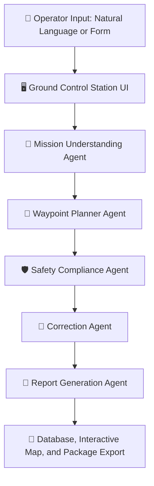
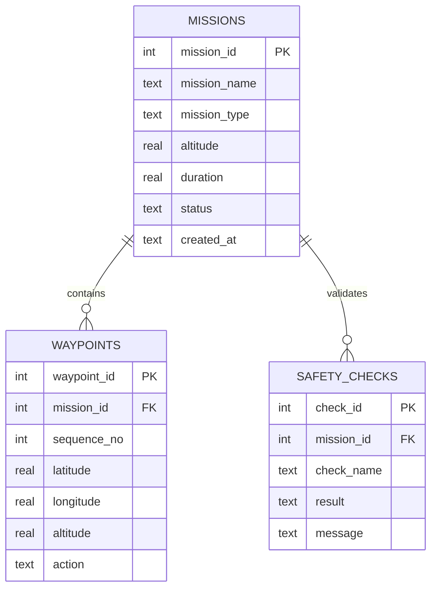

<div align="center">


[](https://www.python.org/)
[](https://streamlit.io/)
[](https://ai.google.dev/)
[](https://sqlite.org/)
[](https://python-visualization.github.io/folium/)


<br/>

> 🛸 **An end to end AI application for planning, validating, and auditing UAV flight missions through an agentic workflow.**
> Accepts natural language requests, generates waypoint trajectories, validates 7 airspace safety rules, suggests corrections, and exports mission packages (JSON, CSV, PDF).

> 🔒 **Fully Software Simulation Project.** No physical UAV hardware required.

</div>

<div align="center">

</div>

---

## 📋 Table of Contents

- [🎯 Problem Statement](#-problem-statement)
- [🏗️ System Architecture](#️-system-architecture)
- [🤖 Agentic Workflow](#-agentic-workflow)
- [✨ Key Features](#-key-features)
- [🎨 Dual Display Modes](#-dual-display-modes)
- [🛡️ Safety Regulations](#️-safety-regulations)
- [🗺️ Waypoint Route Profiles](#️-waypoint-route-profiles)
- [📦 Technology Stack](#-technology-stack)
- [📁 Project Structure](#-project-structure)
- [⚙️ Setup and Run](#️-setup-and-run)
- [🖥️ Application Pages](#️-application-pages)
- [🗄️ Database Schema](#️-database-schema)
- [📅 8 Week Internship Plan](#-8-week-internship-plan)
- [🔮 Future Enhancements](#-future-enhancements)
- [📬 Contact Information](#-contact-information)

---

## 🎯 Problem Statement

UAV mission planning requires precise definition of waypoints, altitude ceilings, flight duration, geofence restrictions, takeoff logic, and return to launch points. Manual planning is error prone and can cause critical failures:

<div align="center">

| Risk Factor | Operational Impact |
|---|---|
| 🔴 Missing Landing or RTL Sequence | Drone loss or crash when battery drains |
| 🔴 Excess Altitude Ceilings | Regulatory violation and airspace hazards |
| 🔴 Routes Traversing Restricted Airspace | Collisions or severe legal penalties |
| 🔴 Unvalidated Battery Consumption | Flight termination mid air |

</div>

This project provides an intelligent ground control software assistant that automates mission drafting, audits compliance rules, and suggests safety fixes before takeoff.

---

## 🏗️ System Architecture

<div align="center">



</div>

---

## 🤖 Agentic Workflow

The core architecture operates with **5 specialized AI agents** working sequentially to transform raw prompt inputs into validated flight plans:

<div align="center">

| Agent | Module Path | Operational Role |
|---|---|---|
| 🧠 **Mission Understanding** | `agents/mission_understanding_agent.py` | Extracts parameters via Google Gemini AI with regex fallback |
| 📍 **Waypoint Planner** | `agents/waypoint_planner_agent.py` | Computes coordinates, altitudes, and RTL points across 4 profiles |
| 🛡️ **Safety Compliance** | `agents/safety_compliance_agent.py` | Audits 7 airspace rules covering geofences, altitude, and battery |
| 🔧 **Correction** | `agents/correction_agent.py` | Recommends actionable fixes for safety check violations |
| 📄 **Report Generation** | `agents/report_agent.py` | Generates HTML summary reports with checklists and metrics |

</div>

### 💬 Example Natural Language Prompt

```text
Plan a surveillance mission around FAST campus for 15 minutes at 50 meters altitude using a square pattern layout.
```

### 📤 Extracted JSON Representation

```json
{
  "mission_name": "FAST Surveillance",
  "mission_type": "surveillance",
  "altitude": 50.0,
  "duration": 15.0,
  "pattern": "square"
}
```

---

## ✨ Key Features

- 🗣️ **Natural Language Request Processing**: Google Gemini AI API integration with automatic regex fallback.
- ⚙️ **Manual Parameter Control**: Precise manual inputs for altitude, duration, pattern, and home coordinates.
- 📍 **4 Waypoint Route Profiles**: Automatic generation of Square, Grid, Circle, and Perimeter flight trajectories.
- 🎨 **Dual Display Modes**: Instant toggle between Dark Mode and Light Mode with inverted high contrast card colors.
- 🗺️ **Live GCS Mission Radar**: Interactive Folium map with auto tile switching (Positron Light map vs Dark Matter map).
- 🛡️ **7 Rule Airspace Safety Auditor**: Automated checks for altitude limits, RTL points, no fly zones, leg distance, and battery.
- 💡 **Actionable Correction Suggestions**: Instant recommendations generated for failed safety checks.
- 📊 **Telemetry HUD Metrics**: Real time status overview for altitude, flight duration, status, and route profile.
- 🗄️ **SQLite Persistence**: Complete mission history, waypoints list, and compliance records stored locally.
- 📥 **Multi Format Export**: One click downloads for Mission JSON, Waypoint CSV, and PDF Report.

---

## 🎨 Dual Display Modes

The application features a built in display mode switcher with dynamic color inversion for optimal visibility:

<div align="center">

| Element | 🌙 Dark Mode | ☀️ Light Mode |
|---|---|---|
| **Page Background** | Pure Black (`#000000`) | Pure White (`#FFFFFF`) |
| **Page Text Color** | Crisp White (`#FFFFFF`) | Crisp Black (`#000000`) |
| **Card and Box Background** | White (`#FFFFFF`) | Black (`#000000`) |
| **Card and Box Text Color** | Black (`#000000`) | White (`#FFFFFF`) |
| **Live Map Tile** | CARTO Positron Light Map | CARTO Dark Matter Dark Map |
| **Sidebar Background** | Dark (`#050505`) | Light (`#F8FAFC`) |

</div>

---

## 🛡️ Safety Regulations

<div align="center">

| Regulation ID | Rule Description | Compliance Threshold |
|---|---|---|
| **R1** | Maximum Altitude Ceiling | Altitude ≤ 80 metres |
| **R2** | Mandatory Takeoff Command | First waypoint must be Takeoff |
| **R3** | Return to Launch (RTL) | Last waypoint must be RTL or Land |
| **R4** | No Fly Zone Clearance | Zero entry into restricted zones |
| **R5** | Max Leg Separation | Distance between points ≤ 500 metres |
| **R6** | Mission Duration Ceiling | Duration ≤ 30 minutes |
| **R7** | Battery Consumption Reserve | Estimated battery usage < 80% |

</div>

---

## 🗺️ Waypoint Route Profiles

<div align="center">

| Profile | Geometric Trajectory | Primary Application |
|---|---|---|
| 🟦 **Square** | 4 point perimeter pattern centered on home | Surveillance and area patrol |
| 🟩 **Grid** | Cross hatch scanning grid | Aerial mapping and land survey |
| ⭕ **Circle** | 8 point orbital circular route | Point of interest inspection |
| 🔲 **Perimeter** | Outer boundary boundary patrol | Security perimeter auditing |

</div>

All waypoint profiles automatically inject a **Takeoff** point at start and an **RTL** point at finish.

---

## 📦 Technology Stack

<div align="center">

| Category | Technology |
|---|---|
| 🐍 Core Language | Python 3.10+ |
| 🖥️ UI Framework | Streamlit |
| 🧠 AI Intelligence | Google Gemini API |
| 📊 Data Processing | Pandas |
| 🗺️ Geospatial Maps | Folium and Streamlit Folium |
| 🗄️ Database | SQLite3 |
| 📐 Geometry Engine | Shapely |
| 📄 Document Export | ReportLab (PDF Generation) |

<br/>


&nbsp;

&nbsp;

&nbsp;

&nbsp;


</div>

---

## 📁 Project Structure

```text
agentic-uav-mission-planner/
├── 🚀 app.py                            # Main Streamlit GCS application
├── 📋 requirements.txt                  # Python dependencies
├── 📘 README.md                         # Project documentation
├── 🔑 .env                              # Environment configuration
│
├── 🗄️ database/
│   └── missions.db                      # SQLite database storage
│
├── 📊 data/
│   ├── sample_missions.csv              # Sample mission benchmark dataset
│   └── sample_waypoints.csv             # Sample waypoint sequence dataset
│
├── 🤖 agents/
│   ├── mission_understanding_agent.py   # Gemini AI prompt parser
│   ├── waypoint_planner_agent.py        # Route pattern calculation engine
│   ├── safety_compliance_agent.py       # 7 rule airspace auditor
│   ├── correction_agent.py              # Automated violation corrector
│   └── report_agent.py                  # HTML summary report builder
│
├── 🧰 utils/
│   ├── database_utils.py                # SQLite CRUD operations
│   ├── map_utils.py                     # Folium map builder and tile switcher
│   ├── export_utils.py                  # JSON, CSV, and PDF exporters
│   └── distance_utils.py                # Haversine distance and bearing math
│
├── 📄 reports/
│   └── generated_reports/               # Exported PDF report artifacts
│
└── 📚 docs/
    ├── uav_terms.md                     # UAV domain terminology dictionary
    ├── project_report.docx              # Comprehensive technical report
    ├── user_manual.pdf                  # Operating manual
    └── presentation.pptx                # Mission planner deck
```

---

## ⚙️ Setup and Run

<details open>
<summary><b>1️⃣ 📥 Clone Repository</b></summary>
<br/>

```bash
git clone https://github.com/AbdulAzeemHashmi/agentic-uav-mission-planner.git
cd agentic-uav-mission-planner
```

</details>

<details open>
<summary><b>2️⃣ 🐍 Create Virtual Environment</b></summary>
<br/>

```bash
python -m venv .venv
.venv\Scripts\activate        # Windows PowerShell / CMD
# or
source .venv/bin/activate     # Linux / macOS
```

</details>

<details open>
<summary><b>3️⃣ 📦 Install Dependencies</b></summary>
<br/>

```bash
pip install -r requirements.txt
```

</details>

<details open>
<summary><b>4️⃣ 🔑 Configure Google Gemini API Key (Optional)</b></summary>
<br/>

Create a `.env` file in the project root directory:

```env
GEMINI_API_KEY=your_gemini_api_key_here
```

> Note: If no API key is provided, the Mission Understanding Agent seamlessly utilizes the built in regex parser fallback.

</details>

<details open>
<summary><b>5️⃣ ▶️ Launch Application</b></summary>
<br/>

```bash
streamlit run app.py
```

The Ground Control Station dashboard will open automatically at `http://localhost:8501` 🎉

</details>

---

## 🖥️ Application Pages

<div align="center">

| Page | Description |
|---|---|
| 🏠 **Home** | Dashboard overview, system description, active safety rules |
| 📝 **Mission Input** | Natural language prompt parser and manual override form |
| 📋 **Mission Plan** | Route pattern selector, waypoint list, and mission summary report |
| 🗺️ **Map View** | Flight telemetry breakdown and full map coordinate view |
| 🛡️ **Safety Check** | Compliance auditor evaluating rules R1 to R7 with database save |
| 💡 **Suggestions** | Recommended corrections generated by the Correction Agent |
| 📥 **Export** | One click downloads for JSON, CSV, and PDF packages |

</div>

---

## 🗄️ Database Schema

<div align="center">



</div>

---

## 📅 8 Week Internship Plan

<div align="center">

| Week | Focus Area | Deliverables |
|---|---|---|
| 1️⃣ | Setup and Domain Research | Tools setup, repo init, UAV glossary |
| 2️⃣ | Data Model and Input Form | Mission state model and manual parameter UI |
| 3️⃣ | Waypoint Generation Engine | Square, Grid, Circle, and Perimeter trajectory math |
| 4️⃣ | Map Visualization Layer | Interactive Folium live map integration |
| 5️⃣ | Safety Compliance Auditor | 7 rule validation engine implementation |
| 6️⃣ | Agentic Intelligence Layer | 5 specialized agents connecting LLM workflow |
| 7️⃣ | Database and Package Export | SQLite database CRUD and JSON/CSV/PDF exporters |
| 8️⃣ | System Verification and UI Polish | Dual mode switcher, documentation, and final release |

</div>

---

## 🔮 Future Enhancements

1. 🗺️ **QGroundControl Export**: Direct `.plan` format export for Mavlink ground stations.
2. 🛩️ **PX4 SITL Integration**: Software in the loop flight simulation testing.
3. 🛸 **Multi UAV Swarm Support**: Synchronized mission planning for multiple drones.
4. 🔋 **Advanced Battery Physics**: Drag, wind velocity, and payload mass calculation.
5. ⛈️ **Real Time Weather Audit**: Live METAR and wind vector safety checking.
6. 🎙️ **Voice Command Inputs**: Speech to text mission prompt processing.

---

## 📬 Contact Information

<div align="center">

**Abdul Azeem Hashmi**

📧 Email: [abdulazeemhashmi29@gmail.com](mailto:abdulazeemhashmi29@gmail.com)  
🐙 GitHub Profile: [@AbdulAzeemHashmi](https://github.com/AbdulAzeemHashmi)  
📦 Project Repository: [agentic-uav-mission-planner](https://github.com/AbdulAzeemHashmi/agentic-uav-mission-planner)

<br/>

### ⭐ Support the Project

If you found this repository useful, please consider starring it!

<a href="https://github.com/AbdulAzeemHashmi/agentic-uav-mission-planner/stargazers">

</a>

<br/><br/>

Designed with 🛸 and Agentic Intelligence by Abdul Azeem Hashmi.


</div>
