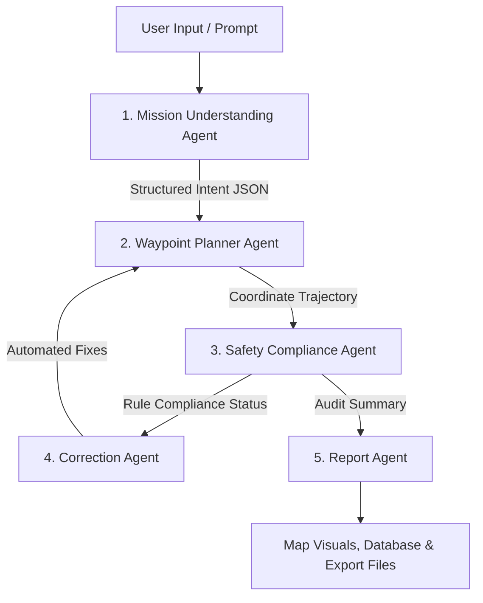

<div align="center">


[](https://www.python.org/)
[](https://streamlit.io/)
[](https://ai.google.dev/)
[](https://sqlite.org/)
[](https://python-visualization.github.io/folium/)
[](https://www.docker.com/)
[](./LICENSE)


<br/>


<br/>

> 🛩️ Agentic UAV Mission Planner converts natural language mission goals into validated UAV flight plans with AI planning, safety checks, and export ready files.
>
> 🔒 This repository is a software simulation only. No actual drone hardware is controlled.

</div>

---

## 🚀 What This Project Does

Agentic UAV Mission Planner is an intelligent Streamlit web application that transforms text based mission requests into complete UAV flight plans. Powered by five specialized AI agents, the system automates:

- 🧠 **Natural Language Parsing**: Extracts mission intent, cruise altitude, duration, and flight geometry.
- 📍 **Waypoint Trajectory Generation**: Computes coordinates for square, grid mapping, circular orbit, and perimeter sweep patterns.
- 🛡 **7-Rule Airspace Safety Auditing**: Verifies altitude ceiling, mandatory takeoff, RTL landing points, geofenced no fly zones, leg separation, flight duration, and battery reserve limits.
- 🔧 **AI Correction Recommendations**: Generates actionable recovery steps and parameter adjustments for non compliant missions.
- 📤 **Multi Format Exports**: Generates production ready mission packages for QGroundControl (.plan), ArduPilot (.waypoints), Google Earth (.kml), JSON, CSV, and PDF audit reports.
- 📂 **Mission Storage Engine**: Full SQLite database integration to save, filter, clone, load, and batch export past missions.

---

## 🖼️ Demo Gallery

### 🛩️ Control Station Overview & Live Airspace Radar

<div align="center">
  
  <br/>
  <i>Ground Control Station Overview with telemetry metrics and active safety regulation guidelines.</i>
</div>

---

### ✍️ AI Parameter Extraction & Manual Telemetry Controls

<div align="center">
  
  <br/>
  <i>Natural language request processing powered by Google Gemini AI and live airspace radar integration.</i>
  <br/><br/>
  
  <br/>
  <i>Manual parameter controls for mission name, target altitude, flight duration, and launch coordinates.</i>
</div>

---

### ⚙️ Trajectory Generator, Summary Report & Waypoint Sequence

<div align="center">
  
  <br/>
  <i>Mission Route Planner with active setup, geometry options, and interactive waypoint editor table.</i>
  <br/><br/>
  
  <br/>
  <i>Mission Summary Report Card with elevated metric boxes and rule compliance checklist.</i>
  <br/><br/>
  
  <br/>
  <i>Telemetry and Coordinates Control displaying flight summary metrics and sequenced waypoint list.</i>
</div>

---

### 🛡️ Safety Compliance Auditor & AI Fix Suggestions

<div align="center">
  
  <br/>
  <i>7-Rule Safety Auditor displaying pass status across all airspace regulation checks.</i>
  <br/><br/>
  
  <br/>
  <i>Correction Suggestions Agent providing automated recovery recommendations for safety violations.</i>
</div>

---

### 📥 Mission Package Exports & Database History Management

<div align="center">
  
  <br/>
  <i>Export center supporting QGroundControl (.plan), ArduPilot (.waypoints), KML, JSON, CSV, and PDF reports.</i>
  <br/><br/>
  
  <br/>
  <i>SQLite Mission History with search, filter, date range, pagination, and batch export controls.</i>
  <br/><br/>
  
  <br/>
  <i>Saved mission record view with telemetry specs, sequence table, preview on map, and quick actions.</i>
</div>

---

## 🧠 How the Agent Chain Works

The application processes user requests through a five agent pipeline:


```mermaid
flowchart TD
    A[User Input / Prompt] --> B[1. Mission Understanding Agent]
    B -->|Structured Intent JSON| C[2. Waypoint Planner Agent]
    C -->|Coordinate Trajectory| D[3. Safety Compliance Agent]
    D -->|Rule Compliance Status| E[4. Correction Agent]
    D -->|Audit Summary| F[5. Report Agent]
    E -->|Automated Fixes| C
    F --> G[Map Visuals, Database & Export Files]
```

---

## 🤖 Agent Roles & Responsibilities

| Step | Agent | Role | Output |
|---|---|---|---|
| 1 | 🧠 Mission Understanding Agent | Natural language entity extraction | Struct JSON parameters |
| 2 | 📍 Waypoint Planner Agent | Flight trajectory coordinate math | Sequenced Waypoint list |
| 3 | 🛡 Safety Compliance Agent | 7-Rule airspace safety evaluation | Rule Pass/Fail Audit |
| 4 | 🔧 Correction Agent | Automated fix recommendations | Corrected Telemetry & WPs |
| 5 | 📄 Report Agent | HTML summary & export file generation | PDF, JSON, CSV, GCS Files |

---

## 🛡 Airspace Safety Compliance Rules

Every flight trajectory is automatically audited against 7 strict airspace safety rules:

| Rule | Parameter | Constraint / Limit | Audit Status |
|---|---|---|---|
| R1 | Altitude Ceiling | Maximum 80.0 meters | Mandatory |
| R2 | Initial Sequence | Takeoff command verification | Mandatory |
| R3 | Terminal Action | Return to Launch (RTL) or Landing point | Mandatory |
| R4 | Restricted Airspace | Zero entry into geofenced No Fly Zones | Mandatory |
| R5 | Leg Separation | Maximum 500.0 meters between waypoints | Mandatory |
| R6 | Flight Window | Maximum 30.0 minutes planned duration | Mandatory |
| R7 | Energy Budget | Battery consumption reserve under 80 percent | Mandatory |

---

## 🗺 Supported Flight Patterns

| Pattern | Best Use Case | Trajectory Characteristics |
|---|---|---|
| 🟦 Square | Perimeter surveillance and facility inspection | 4-corner box loop with automatic takeoff and RTL |
| ⚡ Grid | Agricultural mapping and land survey | Lawn-mower scan lines with configurable step spacing |
| ⭕ Circle | Point of interest orbit inspection | 360-degree radial orbit around home coordinates |
| 🔷 Perimeter | Border patrol and boundary surveillance | Offset boundary trace surrounding operational zone |

---

## 🌟 Key Features

- 🛩️ **AI Powered Planning**: Convert natural text prompts into structured mission parameters.
- 📍 **Automated Trajectories**: Build custom flight patterns with customizable step and offset dimensions.
- 🗺️ **Live GCS Radar Map**: Interactive Folium map with dark/light CARTO tiles, flight vectors, and NFZ geofences.
- 🛡️ **7-Rule Audit Engine**: Instant airspace rule compliance evaluation.
- 🔧 **AI Fix Suggestions**: Automatic correction guidance for failed safety checks.
- 📂 **SQLite Database**: Save, load, preview, clone, delete, filter, and batch export mission records.
- 📤 **Multi Ground Station Exports**: Export directly to QGroundControl (.plan), ArduPilot (.waypoints), Google Earth (.kml), JSON, CSV, and PDF.
- 🎨 **Responsive UI**: Sleek dark and light display modes with dynamic visual hierarchy.
- 🐳 **Docker Ready**: Pre configured Dockerfile and docker-compose.yml for one command deployment.

---

## 🛠 Technology Stack

| Component | Tool / Framework | Purpose |
|---|---|---|
| Language | Python 3.12 | Core application runtime |
| Web UI | Streamlit 1.32+ | Interactive web interface |
| AI Engine | Google Gemini AI | Natural language processing |
| Geospatial Maps | Folium & Leaflet.js | Live radar map rendering |
| Data Processing | Pandas & NumPy | Telemetry and tabular data handling |
| Spatial Math | Shapely | Geofence intersection & distance calculations |
| Database | SQLite3 | Persistent mission storage |
| PDF Generation | ReportLab | Standard audit report PDF exports |
| Containerization | Docker & Docker Compose | Isolated deployment |

---

## 📁 Repository Structure

```text
agentic-uav-mission-planner/
├── agents/                  AI agent modules for parsing, planning, safety, and reporting
├── config/                  System defaults and geofenced No Fly Zone definitions
├── data/                    Sample mission templates and waypoint datasets
├── docs/                    Project documentation and UAV domain reference guides
├── reports/                 Generated mission audit reports and exports
├── screenshots/             High resolution demonstration screenshots
├── tests/                   Automated test suite (pytest / unittest)
├── utils/                   Helper utilities for spatial math, exports, and database
├── .dockerignore
├── .gitignore
├── app.py                   Main Streamlit web application entrypoint
├── Dockerfile               Production Docker build file
├── docker-compose.yml       Docker Compose orchestration configuration
├── LICENSE                  MIT Open Source License
├── requirements.txt         Python dependency manifest
└── README.md                Project documentation and overview
```

---

## 🚀 Quick Start Guide

### 1. Clone the repository

```bash
git clone https://github.com/AbdulAzeemHashmi/agentic-uav-mission-planner.git
cd agentic-uav-mission-planner
```

### 2. Set up virtual environment & install dependencies

```bash
python -m venv .venv

# Windows
.venv\Scripts\activate

# macOS and Linux
source .venv/bin/activate

pip install -r requirements.txt
```

### 3. Configure Gemini API Key

Create a `.env` file in the root directory:

```env
GEMINI_API_KEY=your_google_gemini_api_key_here
```

*Note: Obtain an API key at [aistudio.google.com/app/apikey](https://aistudio.google.com/app/apikey).*

### 4. Launch the application

```bash
streamlit run app.py
```

Open `http://localhost:8501` in your web browser.

---

## 🐳 Docker Deployment

### Option A: Docker Compose (Recommended)

```bash
docker compose up --build
```

### Option B: Docker CLI

```bash
docker build -t agentic-uav-mission-planner .
docker run -d -p 8501:8501 --env-file .env --name uav-planner agentic-uav-mission-planner
```

Access the app at `http://localhost:8501`.

---

## 🖥 Application Navigation

| Page | Description |
|---|---|
| 🏠 Home | Ground Control Station dashboard, telemetry overview, and safety rules |
| 📝 Mission Input | Natural language prompt processing and manual parameter overrides |
| ⚙️ Mission Plan | Trajectory generation, waypoint table editing, and summary report |
| 🗺️ Map View | Telemetry list and live GCS mission radar map |
| 🛡️ Safety Check | 7-Rule compliance audit results and database save controls |
| 💡 Suggestions | Actionable correction recommendations for failed rules |
| 📥 Export | Download JSON, CSV, PDF, QGroundControl, ArduPilot, and KML files |
| 📂 Mission History | Database search, filter, date range, preview, load, clone, and export |

---

## 📄 License

This project is licensed under the MIT License. See the [LICENSE](./LICENSE) file for full details.

---

<div align="center">


**Built with 🛩️ 🤖 and 💙 for UAV research and education**


</div>